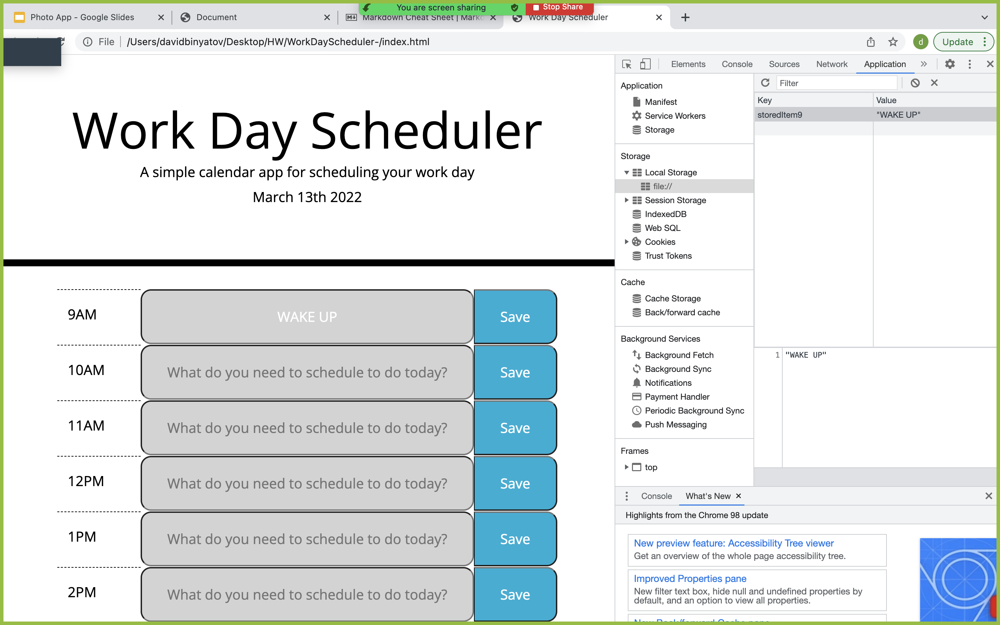

# WorkDayScheduler

## Description 

For this project jQuery was used to create a day planner for a user to schedule their ToDOs, their appointmetns, anything theyd like to in each time block. Local storage is used for persistent data. Moment js is used to display the date. Logic was created also to determine what the current time is in the time blocks(color coded by past, present, or future).

## Deployed Link

[Deployed](https://fuggcodes.github.io/WorkDayScheduler-/)

## ScreenShot

